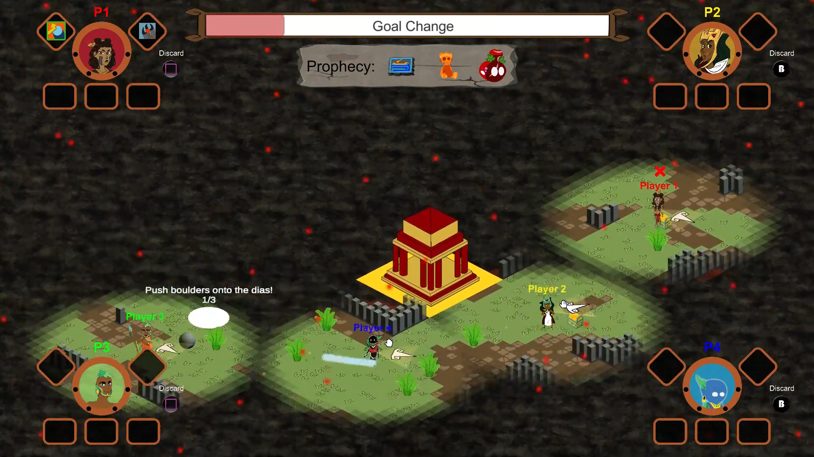
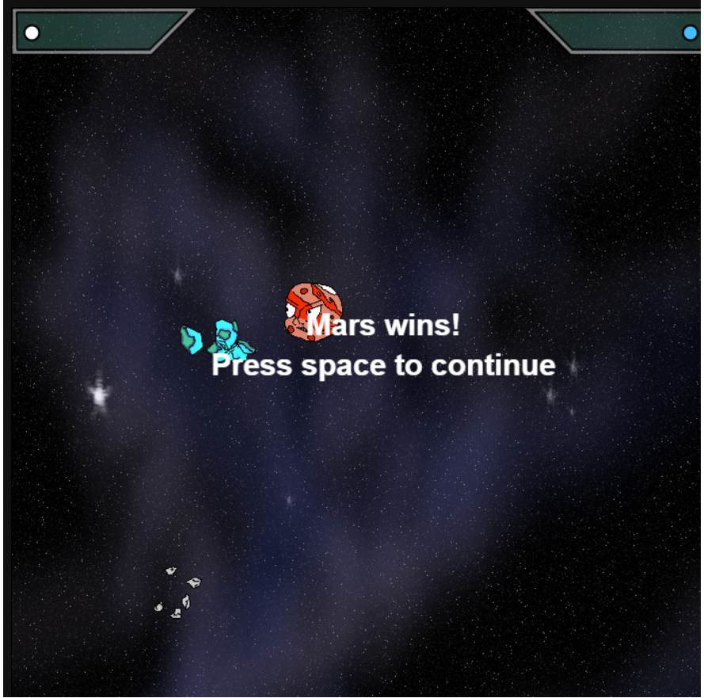
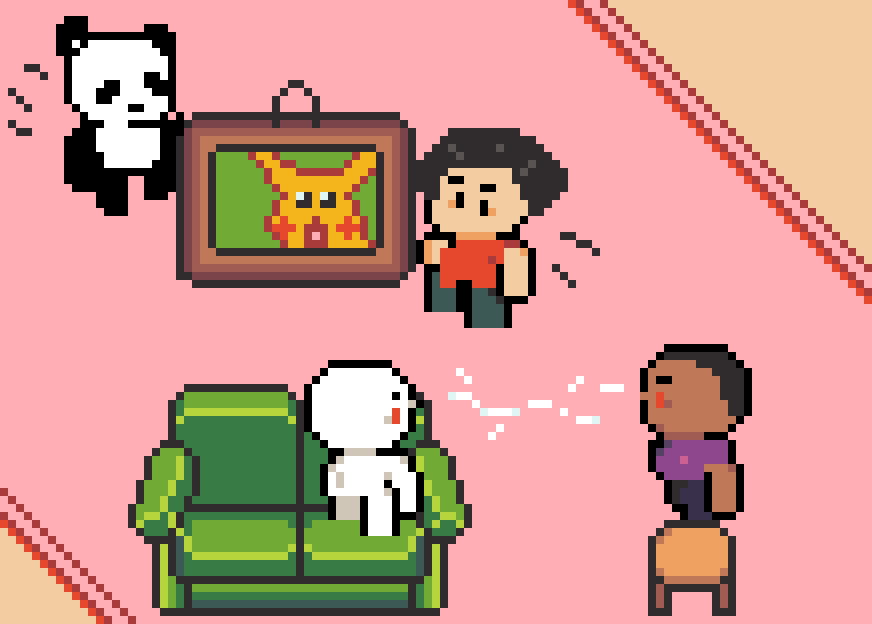
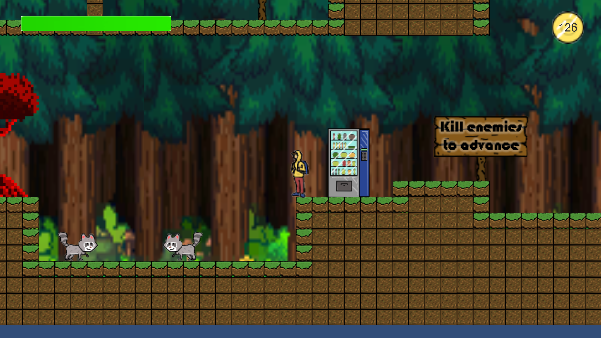
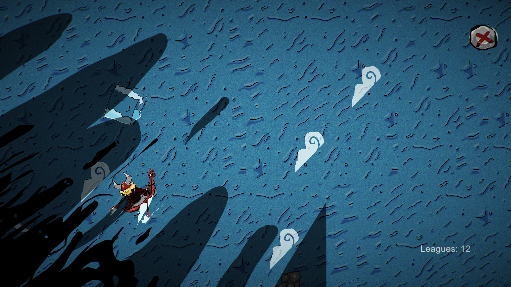
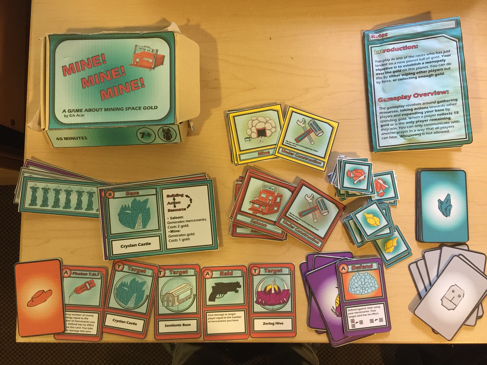
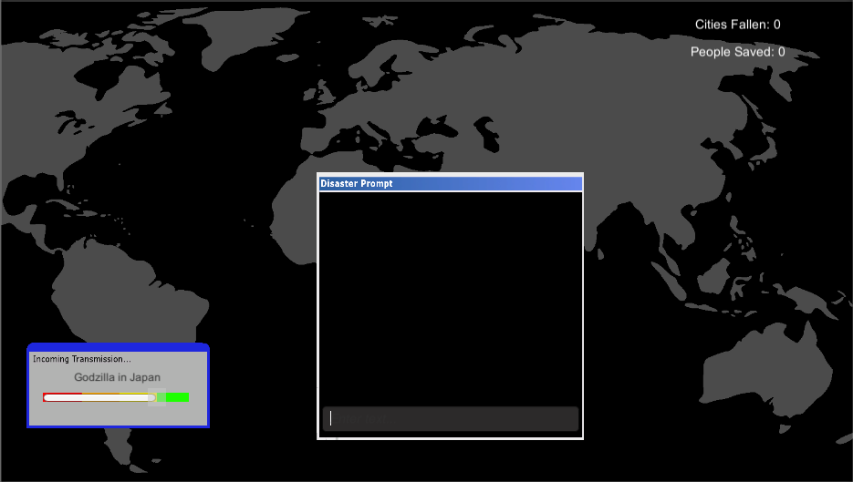
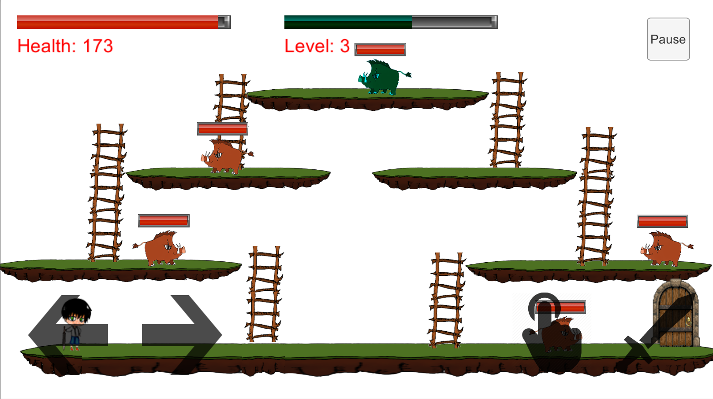

# Erk Acar  
  
**Email:** acarerk@gmail.com
## Portfolio
### About
Game Designer/Developer. Bachelor's of Science in Computer Science: Computer Game Design from **University of California, Santa Cruz.**.
### Technical Projects

#### Games
- **Trials of Tonalli**  
Isometric Collect-a-thon party game with an arena that is continuously and procedurally generated during runtime. Roles: Lead Designer, Technical Director and Audio Lead. UCSC 2020 Games Showcase Design Innovation Award

[Website](http://www.trialsoftonalli.com/)
- **Super Cosmic Clash**  
A 2D fast paced competitive game where the players control planets and try to eliminate each other by throwing asteroids using their gravitational force. Roles: Game Designer, UI and 2D Asset Artist, Programmer, and Audio Lead.

[Play Here](https://ostrichman.itch.io/supercosmicclash) (Tutorial in-game)
- **Furniture Frenzy**  
A 2D top down competitive party game where the players try to hoard more furniture then their oppponents to their home. Roles: UI Artist, Programmer, Game Designer and Audio Engineer.

[Play Here](https://furniturefrenzy.itch.io/furniture-frenzy)
- **Redwood Dreams**  
2D sidescroller adventure game with combo based combat system set in the dream world of a college student.
Solo project. Roles: Game Designer, Artist, Animatior, and Programmer.

[Play Here](http://acarerk.github.io/RedwoodDreamsHTML/index.html) (Tutorial in-game)
- **RünnarStröm**  
**Global Game Jam 2017**  
Isometric endless runner game developed for the annual Global Game Jam with a team in under 72 hours.
Roles: Game Designer and Programmer, 2D Artist and music Audio Lead.

[Play Here](http://acarerk.github.io/RunnarStrom/index.html) (use the left and right arrow keys to move)
- **Mine! Mine! Mine!** 
(solo project)  
A space western themed sci-fi multiplayer card game.

[Rulebook PDF](Rulebook_Erk_Acar.pdf)
- **Doomsday Dispatch**  
A typing game where the player must dispatch help to disaster areas during doomsday.
Global Game Jam 2018 project with a small team. Roles: Game Designer, Artist, Audio Lead, and Programmer.

[Play Here](http://acarerk.github.io/TransmissionHTML/index.html) (Tutorial in-game)
- **Boar Story**  
(solo project)(alpha)  
2D Mobile RPG game with Procedural Loot and Enemy Generation, Save System and Inventory System.

[Play Here](http://acarerk.github.io/BoarStory/index.html) (A and D buttons to move, J to attack and K to interact with stairs, doors and loot)
- **Leap**  
(solo project)  
2D platformer game where collecting coins gets the player extra jumps. 

[Play Here](http://acarerk.github.io/JumpGame/index.html)

#### Web Development
- **Blog Project**   
Developed a blog application using express templating engine. Structured the application so that users can register, log in and create posts with images. Used MongoDB to manage the database. Encrypted the passwords for security, utilized cookies to keep track of user sessions.

#### Procedural Generation
- **Melody Generator**  
An infinite field of generated melodies. Every square in the infinite field is either empty or is occupied by a note in the chosen musical scale. The scale is chosen randomly using the world key. After the generation of the field, a yellow circle that I like to call “The Driver”  appears. The Driver moves southeast in a set pace, playing the note of each square on its way.  After playing 12 notes, the Driver returns to its starting position. This creates a unique repeating  melody. The user can explore the infinite field with the arrow keys and change the starting location of the Driver by clicking on any square on the map. A different starting position means  a different melody. The colors of the ellipses occupying the squares represent the notes they hold. Different world keys will lead to different scattering of notes and possibly a different scale.  
[Link](https://glitch.com/~melody-generator)
- **Alien Generator**  
An infinite list of aliens. Using the seed number provided by  the user, this program creates a list  of generated aliens. The aliens have  seven elements that vary in the  visuals: skin color, mouth type, eye  type, antenna type, number of eyes, number of mouths, and movement. The aliens can be either  friendly or aggressive. Friendly aliens sway from left to right gently while the aggressive aliens  shake rapidly. The eyes of the aliens follow the cursor and clicking changes their mouth shape.  The descriptions are also generated using the user seed number and include the names, the  origin planets and pieces of information regarding the habits of these aliens.  
[Link](https://alien-generator.glitch.me/)
- **Musical Sea**  
A sea of moving Waves that Respond to Musical Input.  This program creates a sea with  moving waves that respond to the  intensity of the musical input by the  user. The user can play notes on the  natural major scale with the keys A  through J. According to the intensity of  the music played, the sea will start  moving faster or slower and different  tracks will fade in or fade out to  complement the change. The order  with which the complementing tracks fade in is determined randomly with the seed. At a certain  level of intensity, the colors of the sea will also change slightly.  
[Link]( https://glitch.com/~musical-sea )

