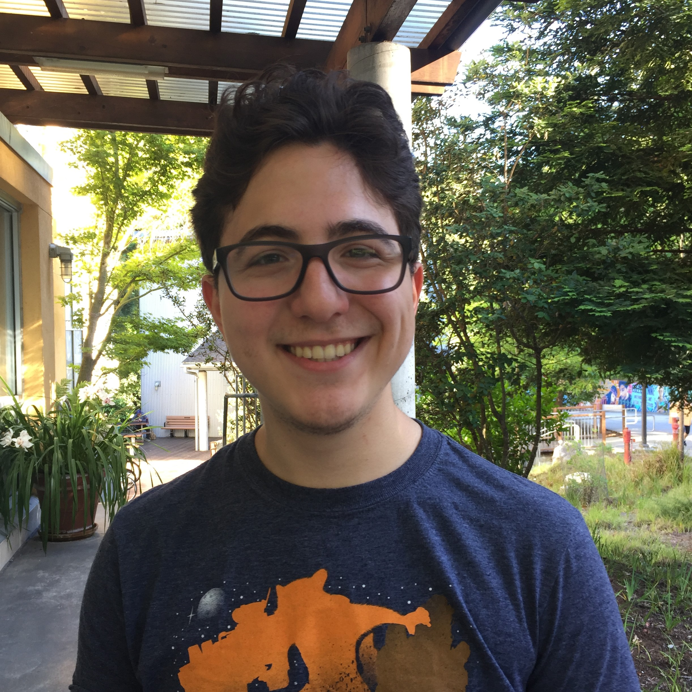
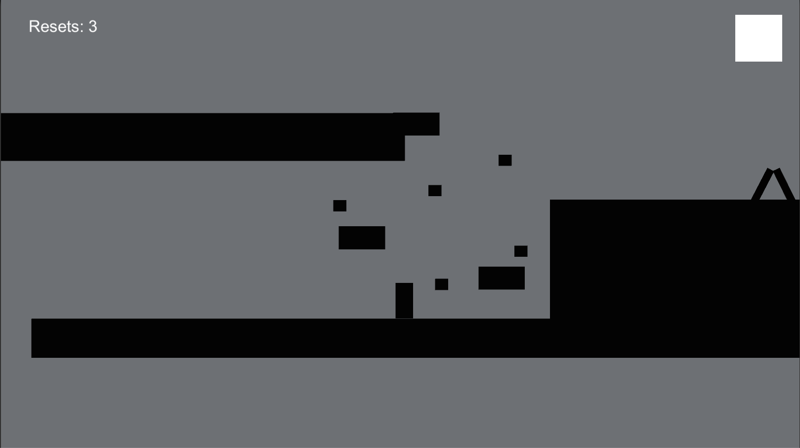

# Erk Acar

**Phone:** 831 419 0881
**Email:** acarerk@gmail.com
## Portfolio
### About
Passionate Computer Science: Computer Game Design student working towards a Bachelor's Degree from University of California Santa Cruz.
### Projects
- **Leap**  
(solo project)
2D platformer game where collecting coins gets the player extra jumps. 

[Play Here](http://acarerk.github.io/JumpGame/index.html)
- **RünnarStröm**  
**Global Game Jam 2017**  
Made an isometric endless runner game for the annual Global Game Jam with a team in under 24 hours.
Did game design and programming, 2D art and music production.
[Play Here](http://acarerk.github.io/RunnarStrom/index.html)

